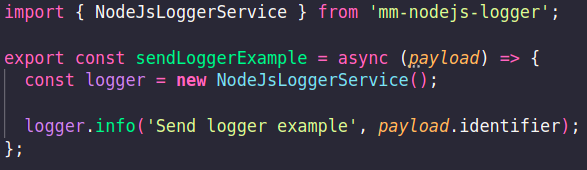

# Node Js Logger

## Índice

* [Descrição](https://github.com/madeiramadeirabr/nest-js-logger/blob/production/docs/techdocs.md#descri%C3%A7%C3%A3o)
* [Configurações](https://github.com/madeiramadeirabr/nest-js-logger/blob/production/docs/techdocs.md#configura%C3%A7%C3%B5es)
  * [Instalar a biblioteca](https://github.com/madeiramadeirabr/nest-js-logger/blob/production/docs/techdocs.md#instalar-a-biblioteca)
  * [Utilizando a biblioteca](https://github.com/madeiramadeirabr/nest-js-logger/blob/production/docs/techdocs.md#utilizando-a-biblioteca)
    * [Exemplo de utilização da biblioteca](https://github.com/madeiramadeirabr/nest-js-logger/blob/production/docs/techdocs.md#exemplo-de-utiliza%C3%A7%C3%A3o-da-biblioteca)
* [Contrato das funções de disparo de logs](https://github.com/madeiramadeirabr/nest-js-logger/blob/production/docs/techdocs.md#contrato-das-fun%C3%A7%C3%B5es-de-disparo-de-logs)
* [Contribuições](https://github.com/madeiramadeirabr/nest-js-logger/blob/production/docs/techdocs.md#contribui%C3%A7%C3%B5es)

## Descrição

O Node Js Logger é uma biblioteca que implementa a padronização de logs da [MMRFC](https://madeiramadeira.atlassian.net/l/cp/an1pP602) para projetos em nodejs na madeiramadeira.

## Configurações

### Orquestração
A orquestração de lambdas na madeira madeira é feita automática ( configuração do new relic )

Porém se faz necessário a adição de algumas configurações no arquivo serverless.yml
Exemplo: https://github.com/madeiramadeirabr/smartcloud-images-integrator/blob/production/serverless.yaml

Também é necessário instalar alguns pacotes utilitários do serverless, como: 

```
    "serverless": "^3.20.0",
    "serverless-offline": "^8.8.1",
    "serverless-plugin-resource-tagging": "^1.2.0",
    "serverless-tag-cloud-watch-logs": "^1.0.0",
    "serverless-webpack": "^5.7.1",
```    

### Instalar a biblioteca

Para usar a biblioteca, você precisa instalar utilizando NPM ou YARN:

###### YARN

```shell
$ yarn add mm-nodejs-logger
```

###### NPM

```shell
$ npm install mm-nodejs-logger
```

### Utilizando a biblioteca

Com a biblioteca instalada e todas as configurações feitas, será necessário importá-la nos arquivos onde serão feitos os logs, injetar a dependência e em seguida chamá-la passando o evento a ser enviado.

```shell
$ import { NodeJsLoggerService } from 'mm-nodejs-logger';
```

Após a importação da biblioteca, deve-se instanciar a classe dentro da função que será utilizada:

```shell
const logger = new NodeJsLoggerService();
```

Exemplo de uso passando o evento a ser enviado para a NewRelic como um log do tipo warn:

```shell
logger.warn(identifier, ContextLoggerEnum.PRODUCT_HUB_PRODUCT_SERVICE_GET_FAILED_MESSAGE);
```

###### Exemplo de utilização da biblioteca



## Contrato das funções de disparo de logs

A biblioteca criará logs com padrão MMRFC com os seguintes modelos de resposta:

```shell
error(message: any, context?: string): void; // Equivalente a error no winston

log(message: any, context?: string): void; // Equivalente a info no winston

warn(message: any, context?: string): void; // Equivalente a warn no winston

debug(message: any, context?: string): void; // Equivalente a debug no winston
```

## Contribuições

[Catalog](https://github.com/orgs/madeiramadeirabr/teams/squad-catalog-admin)

* [Pedro Fellipe Melo](https://github.com/PedroFellipe)
* [Felipe Jhordan](https://github.com/FelipeJhordan)
* [Camila Damásio](https://github.com/CamilaDamasio)
